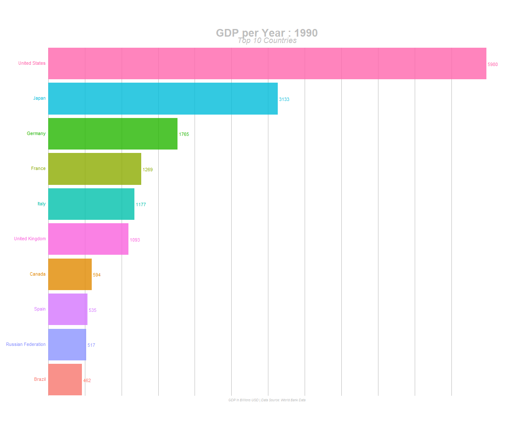

# Barras animadas en R

La finalidad de este repositorio es el de saber crear la estructura necesaria que debe tener la data, para la posterior creación de GIFs.

### Resultado final:

**Paquetes usados**:

+ `gganimate`
+ `tidyverse`

### Fuente de la data:

La data base (`csv`) se obtuvo de [databank.worldbank.org](https://databank.worldbank.org/data/reports.aspx?source=2&series=NY.GDP.MKTP.CD&country=#)

